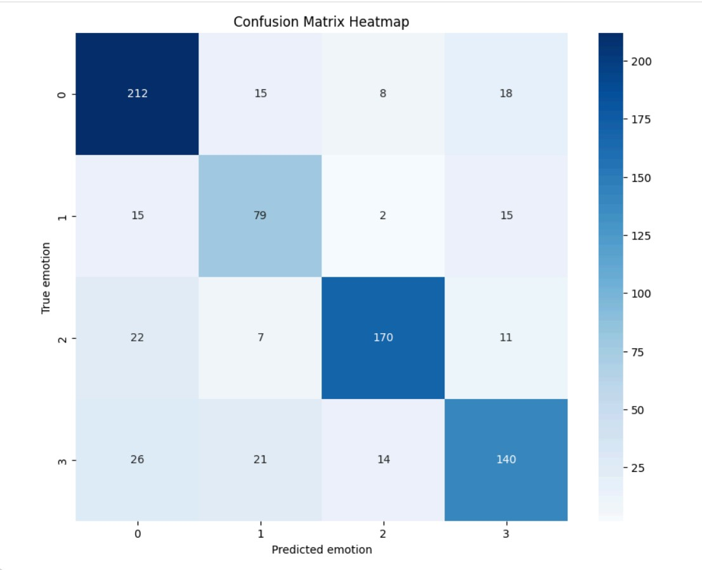

# Emotion Classification from Text Using SBERT and Multinomial Logistic Regression

## Overview

This project develops a text-based emotion classification approach using Sentence-BERT (SBERT) embeddings and a Multinomial Logistic Regression model. SBERT is used to capture semantic information from text, while Multinomial Logistic Regression performs the final classification task. The code was implemented and executed using Google Colab.

## Data

This project uses the Emotions Simplified dataset, which is a simplified version of Google’s official GoEmotions dataset, containing 54,263 samples of real Reddit-style comments, each intended to belong to only one of the 28 emotion classes. The dataset is publicly available at: <https://www.kaggle.com/datasets/sadamumer/emotions-simplified-dataset-28-classes-from-text>

Although the dataset was designed as a single-label simplification of GoEmotions, 8817 samples (16% of data) still contain multiple emotion indices. To obtain a strictly single-label dataset, the multi-labeled samples were removed. This results in a reduced dataset, but ensures alignment with the single-label assumption.

For this study, the problem is simplified to a four-class classification task, distinguishing between 4 emotion categories: *Joy, Sadness, Anger,* and *Fear.* After filtering for the 4 selected emotions, the dataset size was further reduced to 3873 text samples. The dataset contains no missing values.

The text samples were split into training and test sets following a 80:20 ratio. Note that there is moderate class imbalance in the training set, with Anger having the most samples (1012), Fear having the least samples (442), and Joy and Sadness having approximately similar numbers of samples (842 and 802).

## Methods

The pre-trained SBERT model *all-mpnet-base-v2* was used to convert each text sample in the training and test sets into a numerical vector embedding that captures its semantic meaning. Afterwards, L2 normalization was applied to both the training and test vector embeddings so that each vector's length becomes 1.

Next, a Multinomial Logistic Regression model, which is an extension of the original Logistic Regression for multi-class classification problems, was trained using balanced class weights to account for class imbalance and a regularization parameter of C = 0.1 to reduce overfitting.

## Results

The model achieved a training accuracy of 80.41% and a test accuracy of 77.55%. The corresponding macro F1 scores were 0.7967 on the training set and 0.7625 on the test set, indicating reasonably good generalization with limited overfitting.

{width="600" height="500"}

***Figure 1:** Confusion matrix heatmap* *on the test set*

Moreover, the test F1 scores were 0.8030 for Anger, 0.6781 for Fear, 0.8416 for Joy, and 0.7273 for Sadness. Based on the test F1 score for each class and the confusion matrix heatmap on the test set:

- Class 0 (Anger): Recall = 212 / 253 = 0.84. Precision = 212 / 275 = 0.77. This class has strong performance, with most errors coming from confusion with class 3 and class 1.

- Class 1 (Fear): Recall = 79 / 111 = 0.71. Precision = 79 / 122 = 0.65. This class shows the weakest performance and is mainly confused with class 0 and class 3.

- Class 2 (Joy): Recall = 170 / 210 = 0.81. Precision = 170 / 194 = 0.88. This class demonstrates the strongest performance, with most errors coming from confusion with class 0 and class 3.

- Class 3 (Sadness): Recall = 140 / 201 = 0.70. Precision = 140 / 184 = 0.76. This class shows moderate performance and is mostly confused with class 0 and class 1.

Overall, the results suggest that the combination of SBERT embeddings and Multinomial Logistic Regression is effective for classifying text into 4 emotion categories, particularly for identifying Joy and Anger, while Fear remains the most difficult emotion to distinguish from other negative emotions.
